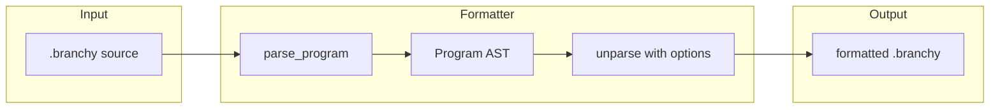

# План: Branchy Formatter

## Контекст

- **Язык**: DSL на деревьях ([README](e:.dev.vibecoding\branchy\README.md)), синтаксис веток `[ a; b; ]`, шаблоны с блоками, функции `!name(:p) = [ ... ]`, события `@name = [ ... ]`, инлайн `<a|b>`, char block `[a-zA-Z:5]`, операторы `+`/`*`, миксины `...:var` / `...include "path"`.
- **Текущее состояние**: парсер и AST есть ([src/parser/](e:.dev.vibecoding\branchy\src\parser/), [src/ast/](e:.dev.vibecoding\branchy\src/ast/)); **обратного вывода AST → текст нет** — форматтер нужно реализовать с нуля.
- **Ограничение**: в лексере/парсере нет комментариев, AST их не хранит — форматирование будет **каноническим** (комментарии при первом прогоне потеряются, если позже добавите комментарии в грамматику — форматтер придётся расширить).

## Архитектура




- **Модуль**: новый `src/formatter/` (или один файл `src/formatter.rs`): принимает `&Program` и опции, возвращает `String`.
- **Зависимости**: только AST и при необходимости экранирование строк (как в лексере) — парсер уже используется в CLI/API для получения `Program`.

## Что реализовать

### 1. Unparse (AST → строка)

- **Program**: `include "path";` по одному на строку, затем функции, затем события, затем main-ветка. Порядок секций фиксированный.
- **Node** ([src/ast/node.rs](e:.dev.vibecoding\branchy\src\ast\node.rs)):
  - **Branch**: `[` + элементы через `;` + `]`; при многострочном стиле — перенос после `[`, отступ для каждого элемента, `]` на новой строке или после последнего `;`.
  - **Leaf**: `Literal::Ident` → как есть; `Param` → `:name`; `OptionalParam` → `:?name`; `Num` → число; `Range(lo, hi)` → `lo..hi`; `Str` → в кавычках с экранированием `"` и `\` (и при необходимости `\n`, `\t` — как в лексере).
  - **BinaryOp**: левый операнд + `+` или `*` + правый; при необходимости скобки (для приоритета при выводе не нужны, т.к. грамматика однозначна).
  - **Call**: `name :p1 :?p2 { :p1 = node; }` — имя, обязательные и опциональные параметры, блок `{ bindings }`; блок форматировать с отступами.
  - **InlineCall**: `name <a|b|c>`.
  - **FuncCall**: `!name(arg1, arg2)` — аргументы через запятую, рекурсивно unparse.
  - **SpreadParam** / **SpreadInclude**: `...:param`, `...include "path"`.
  - **CharBlock**: из `ranges: Vec<(char, char)>` и `count: CharBlockCount` собрать строку вроде `[a-zA-Z]`, `[a-z:5]`, `[a-z:2..5]` (см. [examples/char_block.branchy](e:.dev.vibecoding\branchy\examples\char_block.branchy)); при нескольких диапазонах подряд — объединять в один блок в квадратных скобках.
- **Event**: `@name = [ ... ]`; `"literal" = [ ... ]`; `~"regex" = [ ... ]`.
- **FunctionDef**: `!name(:p1, :p2) = [ ... ]`.

Строки при выводе экранировать так же, как ожидает лексер (обратные слеши и кавычки), чтобы результат был парсируемым.

### 2. Стиль и опции (первая итерация — разумный минимум)

- **indent**: строка отступа (по умолчанию 2 пробела).
- **bracket_style**: однострочная ветка если помещается (например, все дети — короткие листья), иначе многострочная с переносами после `[` и перед `]`. Порог «короткий» можно зафиксировать (например, длина строки < 80 или все элементы — один токен).
- **semicolon**: всегда один `;` между элементами ветки; trailing semicolon после последнего элемента перед `]` — опционально (в грамматике оба варианта допустимы, парсер жуёт несколько `;` подряд). Рекомендация: один `;` между элементами, без trailing для единообразия с примерами.

Опции можно задать структурой `FormatOptions` и передавать в функцию `format_program(program: &Program, options: &FormatOptions) -> String`.

### 3. Точки входа

- **CLI**: новая подкоманда `branchy fmt [path]` (или `branchy format`). Читает файл (или stdin), парсит, форматирует, пишет в stdout или перезаписывает файл при флаге `--write` / `-w`. При ошибке парсинга — вывести ошибку и ненулевой exit code.
- **API** (опционально): `POST /api/format` с телом `{ "source": "..." }` и опционально опциями форматирования; ответ `{ "formatted": "..." }` или 400 с ошибкой парсинга — для кнопки «Форматировать» в веб-интерфейсе.

### 4. Тесты

- Юнит-тесты: `format_program(parse_program(input).unwrap(), &default_options()) == expected` для нескольких примеров (hello, vars, nested, api_style, char_block, с include и событиями). Желательно **идемпотентность**: повторное форматирование уже отформатированного вывода даёт тот же результат.
- Интеграция: CLI `branchy fmt examples/hello.branchy` в CI или ручная проверка.

### 5. CharBlock: обратная сериализация

В AST хранится `CharBlock { ranges: Vec<(char, char)>, count: CharBlockCount }`. Лексер выдаёт токен с уже закодированной строкой (набор диапазонов и опция `:n` / `:lo..hi`). Нужно по `ranges` и `count` сгенерировать строку вида `[a-zA-Z]`, `[a-z:5]`, `[0-9:2..5]` и т.д. — либо вынести общую логику сериализации из лексера/парсера в один место, либо реализовать в форматтере по правилам из README и [char_block.branchy](e:.dev.vibecoding\branchy\examples\char_block.branchy).

## Порядок работ

1. Добавить модуль форматтера и `FormatOptions`; реализовать unparse для всех вариантов `Node`, `Literal`, `Program`, событий и функций с дефолтным (однострочным где коротко) стилем.
2. Реализовать сериализацию `CharBlock` и экранирование строк.
3. Подключить форматтер в CLI: подкоманда `fmt` с чтением/записью и флагом `--write`.
4. Добавить юнит-тесты на idempotency и несколько примеров; при необходимости подправить стиль (переносы, отступы).
5. По желанию: API `POST /api/format` и кнопка на фронте.
6. **Правила**: ввести конфиг (`.branchyrc.json` / `FormatOptions` из конфига) для опций форматтера; при необходимости — отдельный модуль линтера и правила из таблицы выше (сначала possible-errors, потом best-practices).

## Набор правил (по аналогии с ESLint / Prettier)

Разделение по ролям: **форматтер** отвечает за внешний вид (как Prettier), **линтер** — за семантику и предупреждения (как ESLint). Правила можно включать/выключать и задавать severity.

### Форматтер (Prettier-like) — только вывод, без проверок

Один «канон» стиля, минимум опций. Все опции — в `FormatOptions`.


| Правило / опция                | Описание                                            | По умолчанию                            |
| ------------------------------ | --------------------------------------------------- | --------------------------------------- |
| **indent**                     | Строка отступа (только пробелы)                     | `" "` (2 пробела)                       |
| **indent_width**               | Число пробелов (альтернатива indent)                | 2                                       |
| **semicolon_between_elements** | Всегда один `;` между элементами ветки              | `true`                                  |
| **trailing_semicolon**         | Точка с запятой после последнего элемента перед `]` | `false`                                 |
| **bracket_style**              | `"single_line"`                                     | `"multi_line"`                          |
| **max_line_length**            | Порог для `auto` (перенос при превышении)           | 80                                      |
| **spaces_around_binary**       | Пробелы вокруг `+` и `*`                            | `true`                                  |
| **newline_after_include**      | Пустая строка после каждого `include`               | `false` (можно включить для читаемости) |
| **newline_before_main**        | Пустая строка перед главной веткой                  | `true`                                  |


Форматтер не проверяет код на ошибки — только парсит и печатает. Невалидный исходник не форматируется (ошибка парсера).

### Линтер (ESLint-like) — проверки по AST

Правила с severity: `"error"` | `"warn"` | `"off"`. Часть правил — **fixable** (автофикс через форматтер или отдельную команду).

**Категории:**

- **possible-errors** — то, что почти наверняка баг или невалидность.
- **best-practices** — неочевидные или хрупкие места.
- **style** — соглашения по стилю (имена, порядок), по желанию.

**Предлагаемый набор правил:**


| ID                          | Категория       | Описание                                                                                       | Fixable        | Default      |
| --------------------------- | --------------- | ---------------------------------------------------------------------------------------------- | -------------- | ------------ |
| **empty-branch**            | possible-errors | Ветка без элементов `[ ]` или только пустые элементы                                           | нет            | error        |
| **duplicate-binding**       | possible-errors | В одном блоке два присваивания одному параметру: `:x = ... ; :x = ...` (второе перезаписывает) | нет            | warn         |
| **invalid-regex**           | possible-errors | В событии `~"regex"` — невалидное регулярное выражение                                         | нет            | error        |
| **char-block-empty-range**  | possible-errors | В char block диапазон с `lo > hi` (после нормализации пустой)                                  | нет            | warn         |
| **unused-block-param**      | best-practices  | В блоке вызова задан параметр `:x = ...`, но в шаблоне вызова этот параметр не используется    | нет            | warn         |
| **unused-function-param**   | best-practices  | В определении функции параметр объявлен, но в теле не используется                             | нет            | warn         |
| **single-child-branch**     | best-practices  | Ветка с одним ребёнком `[ x; ]` — можно упростить до `x`                                       | да (упростить) | warn         |
| **duplicate-branch-option** | style           | Одинаковые варианты подряд в ветке `[ a; a; ]` (может быть намеренно для веса)                 | нет            | off          |
| **include-path**            | possible-errors | `include "path"` — файл не найден (зависит от cwd/базы; опционально в линтере)                 | нет            | off или warn |
| **naming-convention**       | style           | Имена функций/событий (например, camelCase для функций)                                        | нет            | off          |


**Конфиг правил** — один файл в корне (например `.branchyrc.json` или `branchy.config.json`) или секция в существующем конфиге:

```json
{
  "formatter": {
    "indent_width": 2,
    "bracket_style": "auto",
    "max_line_length": 80
  },
  "linter": {
    "rules": {
      "empty-branch": "error",
      "duplicate-binding": "warn",
      "unused-block-param": "warn",
      "single-child-branch": "warn"
    }
  }
}
```

Или без конфига: форматтер с дефолтными опциями, линтер с дефолтным набором правил (как в таблице выше).

### Связка форматтер + линтер

- **CLI**: `branchy fmt` — только форматирование; `branchy lint` — только проверки; `branchy check` — линт + при желании автофикс (fixable правила применяются через форматтер/упрощение AST).
- **API**: `POST /api/format` (форматтер); `POST /api/lint` (возврат списка диагностик с правилом, severity, строкой/позицией).
- Единый конфиг для обоих инструментов (форматтер опции + правила линтера).

## Риски и нюансы

- **Порядок bindings в блоках**: в AST порядок сохранён; выводить в том же порядке.
- **Пробелы**: при однострочной ветке ставить один пробел после `[` и перед `]` и после каждого `;` для единообразия.
- **Идентификаторы**: выводить как есть; если в будущем появятся ключевые слова — не экранировать их на первом этапе.

